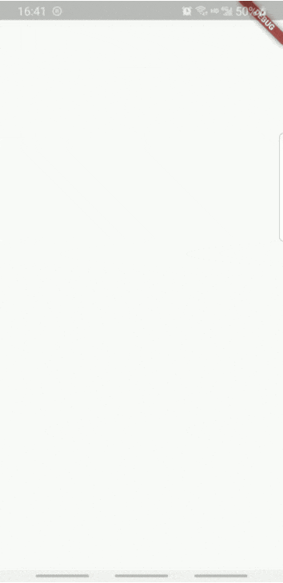

# flutter_staggered_animation_example

flutter 交错的动画 example

## Getting Started

This project is a starting point for a Flutter application.

A few resources to get you started if this is your first Flutter project:

- [Lab: Write your first Flutter app](https://flutter.dev/docs/get-started/codelab)
- [Cookbook: Useful Flutter samples](https://flutter.dev/docs/cookbook)

For help getting started with Flutter, view our
[online documentation](https://flutter.dev/docs), which offers tutorials,
samples, guidance on mobile development, and a full API reference.

更多

- https://medium.com/flutter-community/recreating-slack-apps-on-boarding-animation-with-flutter-ec226ea19403
- https://flutter.dev/docs/development/ui/animations/staggered-animations